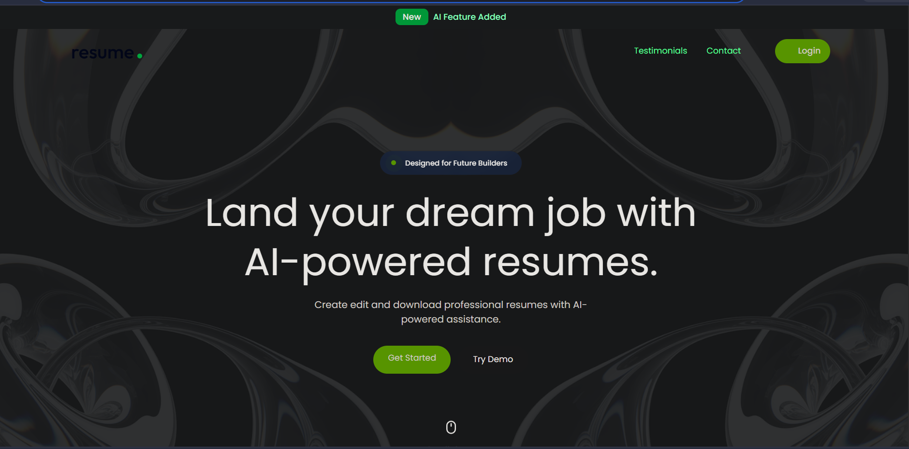
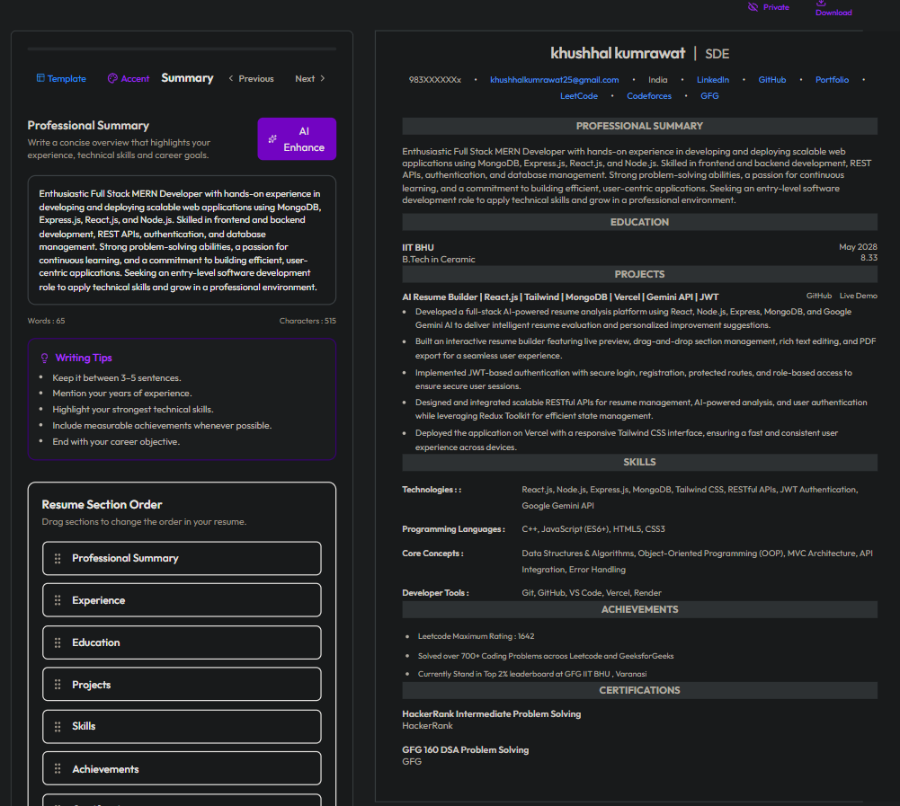
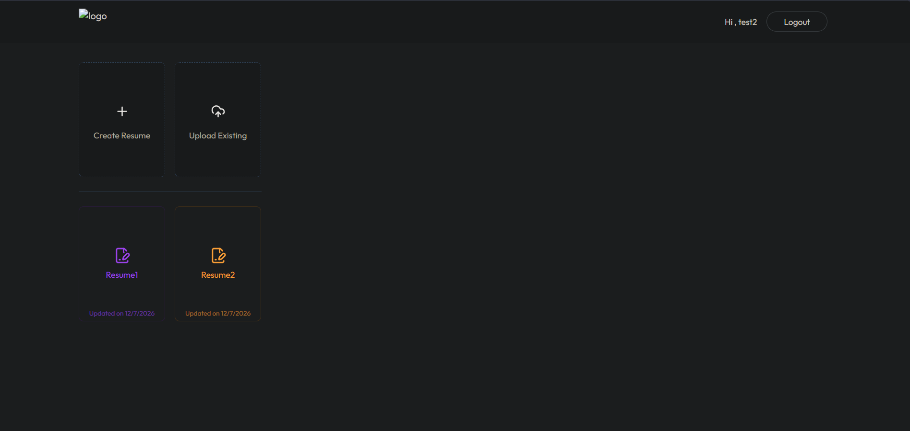

<<<<<<< HEAD
# AI-Resume-Analyzer
=======
<div align="center">
>>>>>>> 24876c2bc53da16661ff3efbf2c5be92f21e9f5e


<h1># 🤖 AI Resume Analyzer – Build ATS-Friendly Resumes with AI</h1>

<p>
An intelligent AI-powered platform to build professional resumes, Help to enchance your content and optimize resumes for better job opportunities.
</p>

<p>

<a href="https://ai-resume-analyzer-khushhal.vercel.app/">

</a>

<a href="https://github.com/khushhalkumrawat/AI-Resume-Analyzer">

</a>


</p>

---

### ⚡ Build Better Resumes • Analyze with AI • Get Interview Ready

</div>

---

# 📖 Overview

Finding a job is difficult—but creating a resume that actually gets noticed is even harder.

**AI Resume Analyzer** helps job seekers build professional resumes, identify missing skills, improve ATS compatibility, and create resumes that recruiters actually want to read.

Whether you're a student, fresher, or experienced professional, this platform guides you through creating stronger resumes with intelligent suggestions and modern resume-building tools.

---

# ✨ Key Features

<table>
<tr>

<td width="50%">

## 🤖 AI Resume Analysis

- AI-powered resume evaluation
- Enhance the user content
- Get the data from your existing Resume
- Resume improvement tips

</td>

<td width="50%">

## 📄 Resume Builder

- Interactive builder
- Multiple sections
- Live preview
- Professional layouts
- Easy customization

</td>

</tr>

<tr>

<td>

## 📤 Export & Share

- PDF Export
- High-quality resume
- Print ready
- Responsive preview
- Modern templates

</td>

</tr>

</table>

---

# 🚀 Why AI Resume Analyzer?

✅ AI-powered resume insights

✅ Professional resume builder

✅ Beautiful resume templates

✅ ATS-friendly formatting

✅ Fast & responsive UI

✅ Secure authentication

✅ Real-time editing

✅ PDF export

✅ Modern user experience

---

# 🛠 Tech Stack

## Frontend

<p>


</p>

- React
- Vite
- Redux Toolkit
- React Router
- Tailwind CSS
- Axios

---

## Backend

<p>


</p>

- Node.js
- Express.js
- MongoDB
- Mongoose

---

## Authentication

- JWT Authentication

---

## AI

- Google Gemini API

---

## Deployment

- Frontend → Vercel
- Backend → Render

---

# 🎯 Target Users

- 🎓 Students
- 👨‍💻 Developers
- 💼 Working Professionals
- 🧑‍🎓 Freshers
- 📈 Career Switchers
- 🚀 Job Seekers

---

# 📸 Screenshots

> Replace these placeholders with actual screenshots of your application.

<div align="center">

| Home Page |
|------------|----------------|
|  |

| AI Analysis | Dashboard |
|--------------|-----------|
|  |  |

</div>

---

# 🏗️ System Architecture

```text
                   ┌────────────────────────────┐
                   │         Frontend           │
                   │        React + Vite        │
                   └─────────────┬──────────────┘
                                 │
                           Axios REST API
                                 │
                   ┌─────────────▼──────────────┐
                   │      Express Backend       │
                   └─────────────┬──────────────┘
                                 │
        ┌────────────────────────┼────────────────────────┐
        │                        │                        │
        ▼                        ▼                        ▼
 JWT Authentication      Gemini AI API          MongoDB Database
        │                        │                        │
        └─────────────── Secure Resume Workflow ──────────┘
```

---

# ⚙️ How It Works

```text
User Login
      │
      ▼
Create Resume / Ex
      │
      ▼
Customize Sections
      │
      ▼
AI Enhadnce Resume
      │
      ▼
Download in High Quality
      │
      ▼
Suggestions & Improvements
```

---

# 📂 Project Structure

```bash
AI-Resume-Analyzer
│
├── client
│   ├── public
│   ├── src
│   │   ├── assets
│   │   ├── components
│   │   ├── configs
│   │   ├── hooks
│   │   ├── layouts
│   │   ├── pages
│   │   ├── redux
│   │   ├── services
│   │   ├── utils
│   │   ├── App.jsx
│   │   └── main.jsx
│   │
│   └── package.json
│
├── server
│   ├── config
│   ├── controllers
│   ├── middleware
│   ├── models
│   ├── routes
│   ├── utils
│   ├── server.js
│   └── package.json
│
└── README.md
```

---

# 🚀 Getting Started

## 1️⃣ Clone Repository

```bash
git clone https://github.com/khushhalkumrawat/AI-Resume-Analyzer.git

cd AI-Resume-Analyzer
```

---

## 2️⃣ Install Dependencies

### Client

```bash
cd client
npm install
```

### Server

```bash
cd server
npm install
```

---

# 🔑 Environment Variables

## Client (.env)

```env
VITE_CLERK_PUBLISHABLE_KEY=
VITE_API_URL=
```

---

## Server (.env)

```env
PORT=

MONGODB_URI=

CLERK_SECRET_KEY=

GEMINI_API_KEY=

JWT_SECRET=
```

---

# ▶️ Run Locally

### Start Backend

```bash
cd server
npm run dev
```

Backend runs on:

```text
http://localhost:5000
```

---

### Start Frontend

```bash
cd client
npm run dev
```

Frontend runs on:

```text
http://localhost:5173
```

---

# 🌍 Deployment

### Frontend

Deploy using:

- Vercel
- Netlify

---

### Backend

Deploy using:

- Render
- Railway
- VPS
- DigitalOcean

---

# 📦 Build for Production

```bash
npm run build
```

---

# 🔒 Authentication

The application uses **JWT Authentication** for:

- Secure Login
- User Registration
- Session Management
- Protected Routes

---

# 🤖 AI Features

✔ Resume Evaluation

✔ Resume Enchanced Content Suggestions

✔ Extract Data from existing Resume

✔ Resume Optimization

---

# 📑 PDF Features

- Resume Preview
- PDF Generation
- High Quality Export
- Printable Resume
- Professional Layout

---
# 🚀 Performance Goals

- ⚡ Fast Resume Generation
- ⚡ Responsive UI
- ⚡ Optimized API Calls
- ⚡ Secure Authentication
- ⚡ ATS-Friendly Resume Output

---

# 🤝 Contributing

Contributions are welcome!

If you'd like to improve this project, follow these steps.

### 1. Fork the Repository

Click the **Fork** button.

### 2. Clone your Fork

```bash
git clone https://github.com/your-username/AI-Resume-Analyzer.git
```

### 3. Create a Branch

```bash
git checkout -b feature/amazing-feature
```

### 4. Commit Changes

```bash
git commit -m "Added Amazing Feature"
```

### 5. Push Changes

```bash
git push origin feature/amazing-feature
```

### 6. Open a Pull Request

Your contribution will be reviewed and merged.

---

# 🐞 Found a Bug?

If you discover a bug:

1. Check existing Issues.
2. Create a new Issue.
3. Explain how to reproduce it.
4. Include screenshots if possible.

---

# 💡 Feature Requests

Have an idea?

Open an Issue with the **enhancement** label.

Suggestions are always welcome.

---

# ⭐ Show Your Support

If you found this project useful,

leave a ⭐ on GitHub.

It motivates future development and helps more developers discover the project.

---

# 🙌 Acknowledgements

Special thanks to the amazing open-source community and the developers behind these technologies:

- React
- Vite
- Tailwind CSS
- Express.js
- MongoDB
- Clerk
- Google Gemini
- Redux Toolkit

---

# 👨‍💻 Author

<div align="center">

## Khushhal Kumrawat

Full Stack Developer • MERN Stack • AI Enthusiast

<p>

<a href="https://github.com/khushhalkumrawat">

</a>

<a href="https://www.linkedin.com/in/khushhal-kumrawat-017bb6390/">

</a>

<a href="mailto:khushhalkumrawat25@gmail.com">

</a>

</p>

</div>

---

# 📄 License

This project is licensed under the **MIT License**.

Feel free to use, modify, and distribute this project in accordance with the license terms.

---

<div align="center">

## 🌟 If you like this project, don't forget to leave a Star!


<br>


</div>
